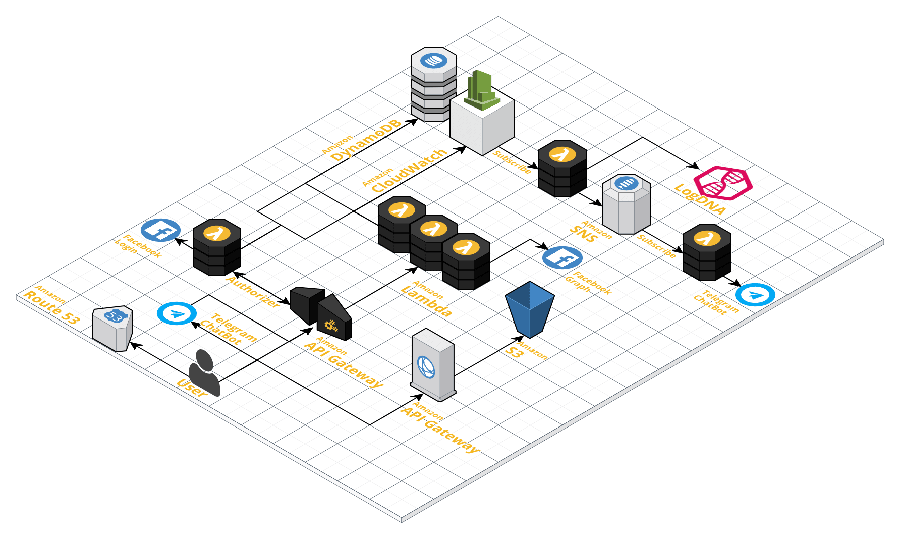

# TOPWorkshop - Serverless

A simple serverless application to show what serverless (the AWS flavour) really is

## Architecture

## TODO List

- [x] Retrieve API endpoint and:
  - [x] Update telegram bot
  - [x] Send via telegram
  - [x] Make lambda endpoint dynamic (for the static part)
- [x] Make VueJS working again
- [x] Remove babel-preset-2015 -> babel-preset-env
- [x] Test log dispatch
- [x] Re-populate config table
- [ ] Add IOpipe
  - [ ] Open issue to serverless-plugin-iopipe
- [x] Add the CodeBuild badge
- [ ] Logs from API Gateway
